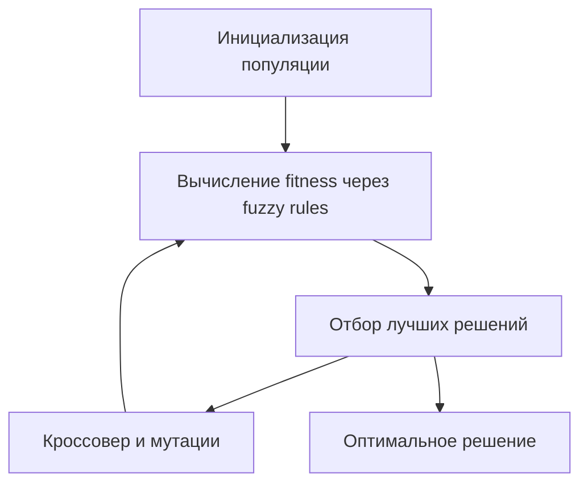

# fuzzy_ga  

⚡️ **Fuzzy Logic + Genetic Algorithm**  
Прототип системы оптимизации решений на основе **нечёткой логики** и **генетического алгоритма**.  

---

## 🔍 Описание  
Проект реализует гибридный подход:  
- 🌀 **Нечёткая логика** используется для моделирования правил и работы с неопределённостью.  
- 🧬 **Генетический алгоритм** применяется для поиска оптимальных решений.  

Такое сочетание позволяет находить решения в задачах, где классическая оптимизация плохо работает из-за большого количества факторов и нечёткости условий.  

---

## ✨ Возможные применения  
- ⚙️ Оптимизация параметров (например, настройки производственного процесса).  
- 📊 Системы поддержки принятия решений.  
- 🤖 Интеллектуальные контроллеры и экспертные системы.  

---

## 🚀 Быстрый старт  
```bash
# Клонирование проекта
git clone https://github.com/chybatronik/fuzzy_ga.git
cd fuzzy_ga

# Запуск демо (пример оптимизации)
go run main.go
```

Пример вывода:
```
Generation 1: Best fitness = 0.42
Generation 2: Best fitness = 0.67
Generation 3: Best fitness = 0.91
...
Оптимальное решение найдено: [X=12.4, Y=3.7]
```

---

## 🛠 Технологии  
- [Go](https://go.dev/) (основная реализация)  
- Алгоритмы **нечёткой логики**  
- **Генетический алгоритм (GA)**  

---

## 📊 Архитектура алгоритма  


---

## 📖 Подробнее  
- [Нечёткая логика (Fuzzy Logic)](https://en.wikipedia.org/wiki/Fuzzy_logic)  
- [Генетический алгоритм (GA)](https://en.wikipedia.org/wiki/Genetic_algorithm)  

---

## 👤 Автор  
Разработано как исследовательский проект во время изучения Go и алгоритмов искусственного интеллекта.  
