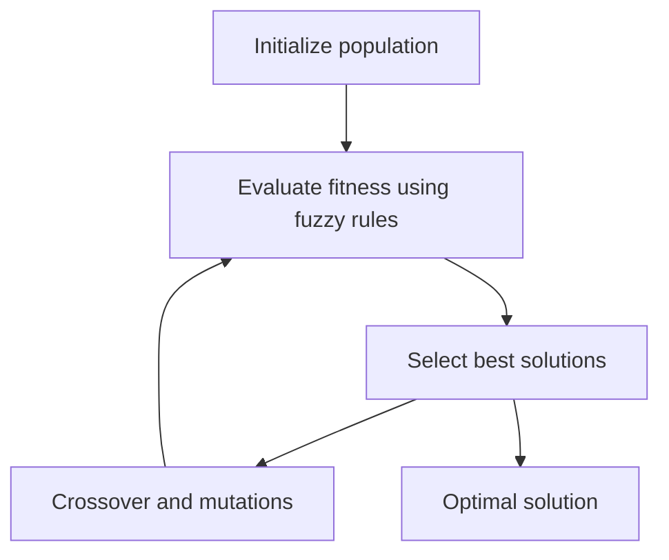

# fuzzy_ga  

⚡️ **Fuzzy Logic + Genetic Algorithm**  
A prototype of a decision optimization system based on **fuzzy logic** and **genetic algorithms**.  

---

## 🔍 Overview  
The project implements a hybrid approach:  
- 🌀 **Fuzzy logic** is used to model rules and handle uncertainty.  
- 🧬 **Genetic algorithms** are applied to search for optimal solutions.  

This combination makes it possible to solve problems where classical optimization struggles due to a large number of factors and uncertain conditions.  

---

## ✨ Potential Applications  
- ⚙️ Parameter optimization (e.g., production process tuning).  
- 📊 Decision support systems.  
- 🤖 Intelligent controllers and expert systems.  

---

## 🚀 Quick Start  
```bash
# Clone the project
git clone https://github.com/chybatronik/fuzzy_ga.git
cd fuzzy_ga

# Run demo (optimization example)
go run main.go
```

Example output:
```
Generation 1: Best fitness = 0.42
Generation 2: Best fitness = 0.67
Generation 3: Best fitness = 0.91
...
Optimal solution found: [X=12.4, Y=3.7]
```

---

## 🛠 Technologies  
- [Go](https://go.dev/) (core implementation)  
- **Fuzzy logic** algorithms  
- **Genetic algorithm (GA)**  

---

## 📊 Algorithm Architecture  


---

## 📖 Learn More  
- [Fuzzy logic](https://en.wikipedia.org/wiki/Fuzzy_logic)  
- [Genetic algorithm (GA)](https://en.wikipedia.org/wiki/Genetic_algorithm)  

---

## 👤 Author  
Developed as a research project while studying Go and artificial intelligence algorithms.  
